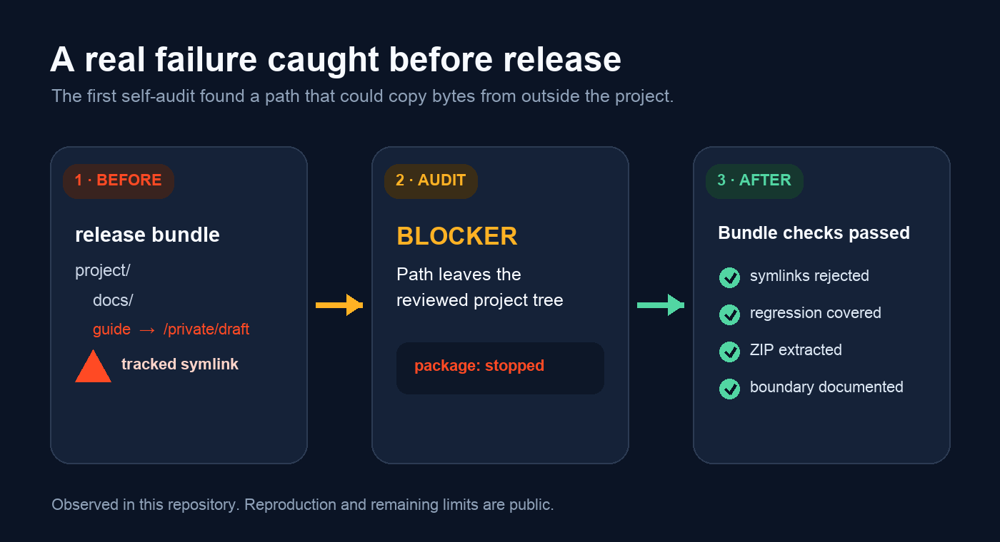

# Launch GitHub Project

Your project works locally. GitHub can still make it look unfinished, unsafe or impossible to try.

**Launch GitHub Project is an Agent Skill that audits what actually exists, chooses the public material this project type needs, connects claims to evidence, builds a deterministic release bundle and keeps every remote action behind explicit approval.**

It is for the awkward gap between “the work is done” and “a stranger can understand, trust and use it.” It supports software, Agent Skills, datasets, research, courses, design resources, portfolios and mixed projects without forcing them through one template.

**Install:**

```bash
npx skills add weike-zhang/launch-github-project --agent codex --skill launch-github-project -g -y
```

Then ask: `Use $launch-github-project to audit this project for GitHub. Start read-only.`

**See evidence first:** [real failure and fix](examples/self-audit-bundle-safety.md) · [verified Codex first audit](evals/results/codex-first-audit-v0.2.0.md) · [latest Release](https://github.com/weike-zhang/launch-github-project/releases/latest)

<p align="center">
  
</p>

<p align="center">
  <a href="README.zh-CN.md">简体中文</a> ·
  <a href="docs/INSTALL.md">Install options</a> ·
  <a href="docs/FIRST-GITHUB-LAUNCH.zh-CN.md">First launch guide</a> ·
  <a href="https://github.com/weike-zhang/launch-github-project/releases/latest">Release</a>
</p>

<p align="center">
  <a href="https://github.com/weike-zhang/launch-github-project/actions/workflows/validate.yml"></a>
  <a href="https://github.com/weike-zhang/launch-github-project/releases/latest"></a>
  <a href="LICENSE"></a>
</p>

## A real failure it caught



Running this Skill against its own repository found that a tracked file symlink could copy bytes from outside the reviewed project into a release ZIP. The bundler now rejects file and directory symlinks before reading them, regression tests preserve the fix, and the remaining concurrent-replacement boundary is documented.

[Read the reproduction, root cause and limits](examples/self-audit-bundle-safety.md) · [Inspect the v0.1.2 fix Release](https://github.com/weike-zhang/launch-github-project/releases/tag/v0.1.2)

This is release-safety evidence, not a claim that automation can prove ownership, product quality or adoption.

## Install and run your first audit

```bash
npx skills add weike-zhang/launch-github-project --agent codex --skill launch-github-project -g -y
```

From the project you want to publish:

```text
Use $launch-github-project to audit this project for GitHub.
Start read-only. Identify the project type, the smallest public surface it needs,
the evidence behind each claim, and every decision required before publishing.
Do not perform remote actions without my explicit approval.
```

A useful first response is structured like this:

```text
Primary type       Agent Skill
Observed           SKILL.md, install path, scripts, release history
Public gap         no direct input/output proof on the first screen
Release blocker    version metadata and latest Release disagree
Human decisions    asset rights, visibility, exact remote target
Action taken       none — read-only audit
```

The exact findings depend on the repository. The important behavior is stable: inspect first, separate facts from assumptions, justify each artifact, and stop before unapproved remote work. See [installation and update options](docs/INSTALL.md).

## What it prepares

| Need | Result |
| --- | --- |
| A README that lists features but does not explain the value | A reader path built around the situation, outcome, direct proof and first useful action |
| Uncertainty about what can safely become public | Redacted secret findings, public-surface blockers and explicit rights decisions |
| Tests being used as marketing proof | Release integrity, behavior evidence, adoption evidence and popularity reported separately |
| A stale or hand-written Release page | A page generated from structured evidence, including optional version-pinned visual proof |
| A source archive that may contain local debris | A deterministic ZIP that excludes local state, rejects symlinks and is actually listed and extracted |
| Local, PR, tag and Release versions drifting apart | A publication-state gate that refuses to call uploaded work released |

The Skill creates only what the project justifies: README, install or reproduction steps, examples, data card, methodology, visual proof, privacy and license guidance, Release page, ZIP or distribution brief. It does not manufacture a website, community, benchmark or roadmap to imitate a mature project.

## Automatic checks and human decisions

| Automated | Still requires judgment |
| --- | --- |
| Local links, unresolved placeholders and machine-specific paths | Whether the first screen makes sense to the intended reader |
| Redacted secret-pattern scan | Whether an apparent secret or personal detail is genuinely safe |
| Nested repositories, editor files, internal drafts and identity-setup copy | Whether assets, data and screenshots may legally be published |
| Release-page freshness and semantic version alignment | Whether the evidence supports the public promise |
| Deterministic bundle contents, symlinks and extraction | Whether the repository deserves to be public and where it should be published |

A clean scan is a gate result, not proof of safety, usefulness or demand.

## How the release path works


1. Audit files, Git state, risks and gaps without editing.
2. Classify the primary project type before choosing artifacts.
3. Build the reader path and the smallest evidence surface for the core promise.
4. Validate links, secrets, public content, visuals, versions and the actual ZIP.
5. Generate a decision-ready Release page and hand off only the authorized remote actions.
6. Verify the public repository and Release from a visitor view.

## Evidence and compatibility

| Surface | Current status | Evidence |
| --- | --- | --- |
| Public v0.2.0: global install → invoke → first audit | Verified on Codex CLI 0.147.0-alpha.6.5 | [Install, clean fixture and observed output](evals/results/codex-first-audit-v0.2.0.md#post-publication-check) |
| Local 0.2.0 candidate: project install → invoke → first audit | Verified on the same host before publication | [Candidate fixture, command and sanitized output](evals/results/codex-first-audit-v0.2.0.md#release-candidate-check) |
| Release scripts | Verified on Python 3.12 | [Regression tests](tests/test_release_tools.py) and [GitHub Actions](https://github.com/weike-zhang/launch-github-project/actions/workflows/validate.yml) |
| Project-type routes and evaluation files | Integrity checked | [Fixture validator](evals/validate_fixtures.py); not a model-quality score |
| Distribution behavior | One exploratory pair | [Exact prompt, baseline, Skill response and limitations](evals/results/model-comparison.md) |
| Other Agent Skills hosts | Unverified | Compatibility reports with host and version are welcome |

## Permissions and limits

- Installing the Skill does not authorize repository creation, Push, visibility changes, Releases or external posts. Every remote action needs an exact target and explicit approval.
- Secret detection is pattern-based and never replaces human review.
- The bundler rejects symlinks and non-regular files, but it is not a sandbox against malicious concurrent file replacement.
- Automated checks cannot prove asset ownership, privacy safety, product quality, user adoption or unsigned rendering.
- Working notes belong in `.launch-github-project/`; the directory is ignored and excluded from release bundles.

Read [PRIVACY.md](PRIVACY.md), [SECURITY.md](SECURITY.md) and the [visual asset notice](assets/ASSET-NOTICE.md) for the full boundaries.

## Contributing

The most useful contribution is a reproducible release failure, a project type the current routing mishandles, a broken first-success path or a public claim whose evidence cannot be checked. See [CONTRIBUTING.md](CONTRIBUTING.md).

MIT licensed. Built by [Weike Zhang](https://github.com/weike-zhang).
