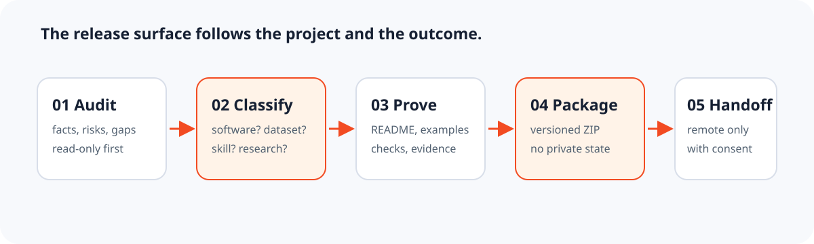

<div align="center">
  

# Launch GitHub Project

**面向任意项目类型的目标驱动发布工作流。**

[English](README.md) · [安装](docs/INSTALL.zh-CN.md) · [首次发布指南](docs/FIRST-GITHUB-LAUNCH.zh-CN.md)

</div>

很多发布建议默认你在做软件产品。这个 Skill 先看项目真实存在的内容，再判断它属于软件、Agent Skill、数据集、课程/文档、研究、设计资源、内容、作品集或通用项目，只生成这个项目确实需要的发布材料。

它会先只读审计，扫描并脱敏疑似密钥，检查本地链接和未完成占位符，按照项目类型准备 README、安装说明、示例、数据卡、方法、案例或视觉预览，生成确定性的发布 ZIP，并根据用户的传播目标、受众、证据、渠道和投入约束规划传播组合。不按天数套日历，也不会未经授权执行远程发布。



## 快速开始

安装 Skill：

```bash
npx skills add weike-zhang/launch-github-project --skill launch-github-project -g
```

在本仓库根目录对目标项目运行本地闸门：

```bash
python skills/launch-github-project/scripts/audit_repository.py ../target-project --json
python skills/launch-github-project/scripts/check_secrets.py ../target-project --json
python skills/launch-github-project/scripts/check_links.py ../target-project
python skills/launch-github-project/scripts/review_public_surface.py ../target-project --strict
python skills/launch-github-project/scripts/build_release_bundle.py ../target-project --output /tmp/project-release.zip
```

在支持 Agent Skills 的客户端中调用：

```text
使用 $launch-github-project 帮我准备这个项目上线 GitHub。先只读审计，
先判断项目类型；只有当决策会改变产物时，才合并询问我；没有我的明确授权不要远程发布。
```

## 设计原则

- 先证据再定位：观察事实、推断、风险和待决策项分开写。
- 先类型再模板：数据集要数据卡，Skill 要触发与行为证据，作品集要责任与结果。
- 先目标再传播：根据用户真正想获得的结果选择最小有效渠道组合，不套固定时间表。
- 先审查公开面再发布：检查准确的暂存树和压缩包、素材权利、证据、Git 身份与未登录访客体验。
- 先本地再远程：审计和打包在本地完成，创建仓库、Push、Release 和外部发帖都作为明确交接步骤。

## 评估证据

```bash
python evals/validate_fixtures.py
```

这里报告的是夹具结构与发布文件检查是否通过，不是模型质量分数。公开的试运行对照包含方法、完整脱敏输出和限制；不会伪造用户数、下载量或“必火”指标。

## 许可

MIT。发布包含第三方图片、字体、数据或文字的项目之前，请先阅读 [SECURITY.md](SECURITY.md) 和 [CONTRIBUTING.md](CONTRIBUTING.md)。

Built by [Weike Zhang](https://github.com/weike-zhang)。
