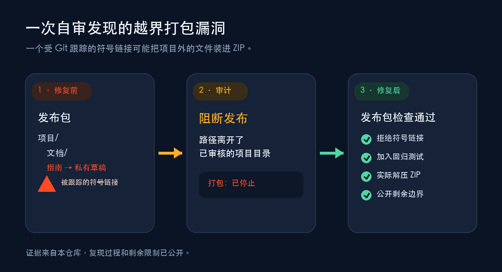

<p align="center">
  
</p>

<p align="center">
  <strong>项目能跑，发布不会收尾？这个 Skill 先找出最劝退新用户的问题，再帮你补齐 README、配图、安装入口、Release 和发布包。</strong>
</p>

<p align="center">
  <a href="#先跑一次只读体检">先跑一次只读体检</a> ·
  <a href="examples/self-audit-bundle-safety.md">看它抓到的真实漏洞</a> ·
  <a href="README.md">English</a>
</p>

很多项目卡在最后一步：代码已经能跑，却不知道 README 先讲什么、该放什么图、安装入口摆在哪，Release 又该怎么写。更麻烦的是，发布包里可能还混着本地文件。

Launch GitHub Project 是一个给项目发布收尾的 Agent Skill。第一轮只读仓库，直接告诉你哪里最影响新用户试用、什么问题会挡住发布、哪些事项必须由你决定。你确认后，它再按项目类型整理 README、配图、安装说明、Release 页面和发布包。

软件、Agent Skill、数据集、研究、课程、设计资源、作品集和混合项目都能用；它不会把不同项目硬塞进同一套模板。改文件和操作 GitHub 仍然需要你的明确授权。

```bash
npx skills add weike-zhang/launch-github-project --agent codex --skill launch-github-project -g -y
```

然后对 Codex 说：`使用 $launch-github-project 给这个项目做一次 GitHub 发布体检。先只读。` 第一轮不会改文件，你会先拿到一张具体的缺口清单。[查看 Codex 首次审计实测](evals/results/codex-first-audit-v0.2.0.md)。

## 一次自审发现的越界打包漏洞



仓库自审发现，被 Git 跟踪的文件符号链接可能把项目外的内容复制进发布 ZIP。

现在，打包器会在读取前拒绝文件和目录符号链接，回归测试也覆盖了这个修复。尚未消除的并发替换风险已经写入文档。

[看完整复现、根因和限制](examples/self-audit-bundle-safety.md) · [看修复该问题的 v0.1.2 Release](https://github.com/weike-zhang/launch-github-project/releases/tag/v0.1.2)

## 先跑一次只读体检

```text
使用 $launch-github-project 审计这个项目的 GitHub 发布面。
先只读，判断项目类型、真正需要的最小公开面、每项主张背后的证据，
以及发布前必须由我决定的事项。没有我的明确授权，不要执行远程动作。
```

第一轮只读检查会返回一份这样的结果：

```text
主要类型        Agent Skill
已经具备        SKILL.md、安装入口、脚本、发布历史
主要缺口        首屏没有直接证据，访客看不出用了会怎样
发布阻断        插件版本和最新 Release 对不上
需要你拍板      素材权利、仓库可见性、准确远程目标
本轮已执行      无；只读审计
```

具体结果会随仓库变化。Skill 会先核对事实并说明需要改什么，远程操作则逐项等待授权。

## 它会检查哪些东西

| 现在的问题 | 改完以后 |
| --- | --- |
| README 像功能清单，用户看不出和自己有什么关系 | 开头先讲用户处境、能得到什么、证据在哪、第一步怎么做 |
| 项目已经更新，README 还在教旧功能和旧命令 | 改完项目后重新通读现有 README；需要更新就直接覆盖旧内容，不另放一份建议稿 |
| 项目里哪些能公开、哪些不能公开，全靠猜 | 给出脱敏密钥发现、公开面阻断项和必须确认的素材权利 |
| 测试一通过，就被包装成“产品有效” | 把发布完整性、行为证据、用户采用和流行度分开讲，不互相冒充 |
| Release 页面靠手写，版本一多就漂 | 从结构化证据生成页面，图片、说明、安装、兼容性和限制跟着版本走 |
| 源码 ZIP 里可能混入缓存、私有状态甚至越界文件 | 生成确定性发布包，拒绝符号链接，并真的列出、解压、复核 |
| 本地、PR、Tag、Release 各说各话 | 上线前核对四个状态，不把“已经上传”包装成“已经发布” |

软件、Agent Skill、数据集、研究、课程、设计资源、作品集和混合项目都能用。它不会强迫所有项目套同一份模板，也不会为了显得成熟，硬造网站、社区、基准测试和路线图。

## 自动检查和人工判断

| 自动检查 | 仍然必须有人判断 |
| --- | --- |
| 本地链接、占位符、机器路径 | 第一屏到底有没有让目标用户产生兴趣 |
| 脱敏密钥模式 | 命中的内容到底是不是秘密或个人信息 |
| 嵌套仓库、编辑器文件、内部草稿、身份设置文案 | 图片、数据和截图有没有权利公开 |
| Release 页面是否陈旧、语义版本是否一致 | 证据够不够支撑对外承诺 |
| ZIP 内容、符号链接、确定性和实际解压 | 这个仓库该不该公开、应该发到哪里 |

扫描全绿只表示自动门禁通过。项目是否安全、好用或有需求，仍需其他证据。

## 发布流程

1. 只读检查文件、Git 状态、风险和缺口。
2. 判断项目类型，再决定需要哪些发布材料。
3. 用真实输入输出、截图或复现步骤支撑公开主张。
4. 检查链接、密钥、公开内容、图片、版本和实际 ZIP。
5. 生成 Release 页面，只执行得到明确授权的远程操作。
6. 发布后以访客身份检查仓库首页和 Release。

## 兼容性与验证状态

| 使用面 | 当前状态 | 证据 |
| --- | --- | --- |
| 公开 v0.2.0：全局安装 → 调用 → 首次审计 | Codex CLI 0.147.0-alpha.6.5 已验证 | [安装、干净夹具和实测输出](evals/results/codex-first-audit-v0.2.0.md#post-publication-check) |
| 本地 0.2.0 候选版：项目级安装 → 调用 → 首次审计 | 发布前在同一客户端已验证 | [候选版夹具、命令和脱敏输出](evals/results/codex-first-audit-v0.2.0.md#release-candidate-check) |
| 发布脚本 | Python 3.12 已验证 | [回归测试](tests/test_release_tools.py)与 [GitHub Actions](https://github.com/weike-zhang/launch-github-project/actions/workflows/validate.yml) |
| 项目类型路径与评估文件 | 只验证结构完整 | [夹具校验器](evals/validate_fixtures.py)，不是模型质量分数 |
| 传播行为 | 只有一组探索性对照 | [完整输入、基线、Skill 响应与限制](evals/results/model-comparison.md) |
| 其他 Agent Skills 客户端 | 未验证 | 欢迎提交包含客户端和版本的实测报告 |

## 权限与限制

- 安装 Skill 不等于允许它建仓库、Push、改可见性、发 Release 或替你发帖。每一个远程动作都要有准确目标和明确授权。
- 密钥扫描靠规则匹配，不能替代人工判断。
- 打包器会拒绝符号链接和非常规文件，但它不是抵御恶意并发替换的通用沙箱。
- 自动检查不能证明素材权利、隐私安全、产品质量、用户采用或未登录页面渲染。
- 工作笔记放进 `.launch-github-project/`；这个目录默认忽略，也不会进入发布包。

完整边界见 [PRIVACY.md](PRIVACY.md)、[SECURITY.md](SECURITY.md)、[视觉素材说明](assets/ASSET-NOTICE.md)和[第三方依赖说明](THIRD-PARTY-NOTICES.md)。

## 贡献可复现的失败案例

最有价值的贡献是可复现的发布失败，例如项目类型分类错误、首次使用流程中断，或公开主张缺少可核验的证据。参见 [CONTRIBUTING.md](CONTRIBUTING.md)。

MIT 许可。作者：[Weike Zhang](https://github.com/weike-zhang)。
